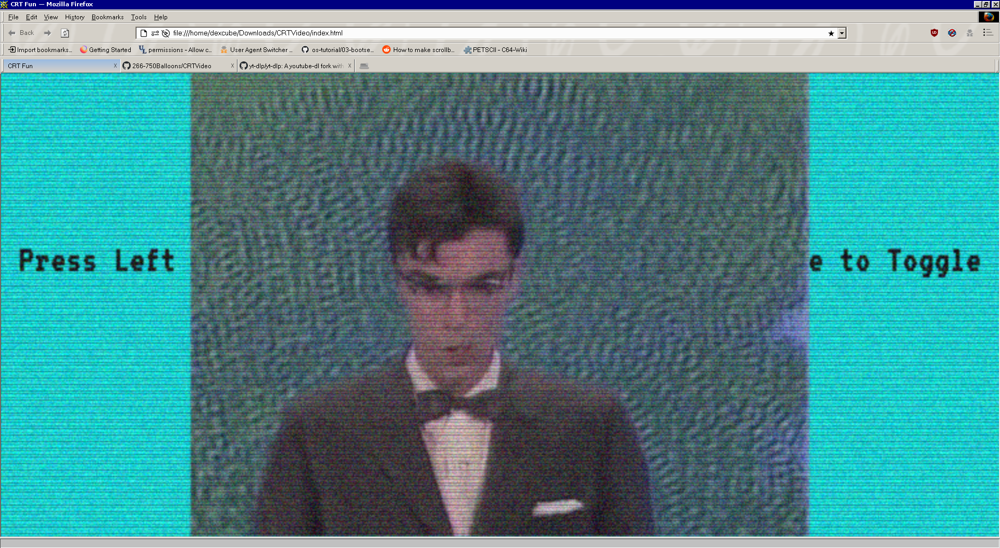

# CRTVideo
CRTVideo is a simple HTML5 video player with a CRT filter

## Usage
Click on the left side of the screen to select a video file to play. Click on the right side to toggle play/pause.

### Acquiring Videos
If you're struggling to find good videos that you have the files to, here are some suggestions:

- Use [yt-dlp](https://github.com/yt-dlp/yt-dlp) to download a Youtube video.

## How it works
I have a javascript script where each frame, it generates a random bitmap on a canvas. The canvas is upscaled to fit the frame (drawing giant random 1080 bitmaps wastes a lot of computing power.).
Another canvas, which is also upscaled to fit the screen, has scanlines drawn on it, using a cosine function. A translation is integrated so that the scanlines can move.

## Attributions
This uses the [VT323 font](https://fonts.google.com/specimen/VT323) by Peter Hull, which is under the [Open Font License](https://scripts.sil.org/cms/scripts/page.php?site_id=nrsi&id=OFL).

Also, the screenshot uses a clip from the classic Talking Heads song, [Once in a Lifetime](https://www.youtube.com/watch?v=5IsSpAOD6K8)
